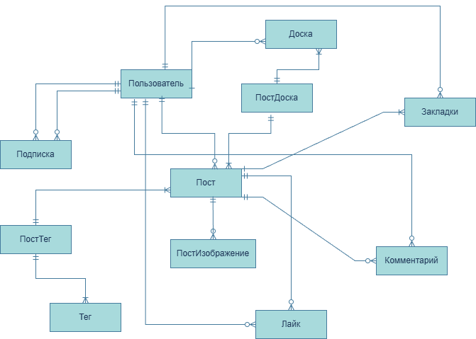

# Платформа для художников и иллюстраторов

# Название:

# Основной планиуремый функционал: 

- система профилей - регистрация авторизация 
- подписки на авторов
- создание досок
- публикация постов - изображения, описание
- поиск по тегам, по авторам
- лента - популярное, случайное, новое
- взаимодействие с постами - лайки, комментарии, добавление в избранное

# Возможно:

- лента на основе рекомендаций
- сообщения
- кастомизация профиля

# Стек:
- бэкенд - django, django rest
- фронтенд - html, css, js, react
- бд - postgres (?)
- мобилка (?) -

# База данных:
er диаграмма

